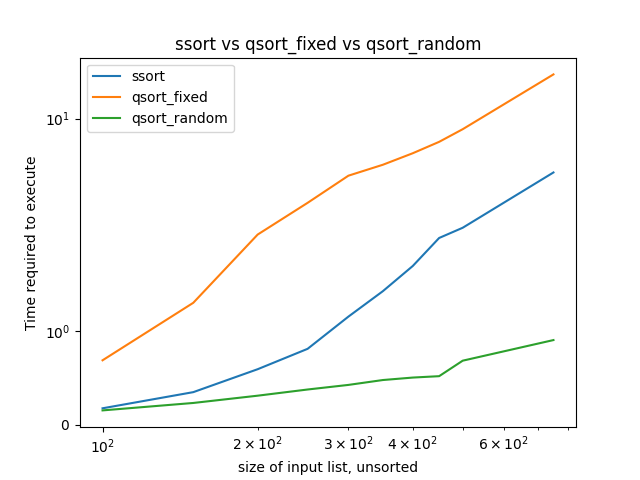

# CMPS 2200 Reciation 5
## Answers

**Name:** Jack Zemke

Place all written answers from `recitation-05.md` here for easier grading.

 **1b.**
  -

I utilized the non-recursive version of `ssort` for this comparison. For my fixed pivot, I placed it at `list[len(list)//2]`, or the center of the list. This may explain it's acceptable performance on presorted lists as opposed to selecting `list[0]`. My system was exceeding maximum recursion depth with `list[0]` as the fixed pivot.

Random Permutations:
|     n (shuffled) |     ssort |   qsort-fixed-pivot |   qsort-random-pivot |
|-------|-----------|---------------------|----------------------|
|   100 |    0.105 |               0.075 |                0.090 |
|   200 |    0.367 |               0.149 |                0.190 |
|   500 |    2.118 |               0.366 |                0.541 |
|  1000 |    8.196 |               0.800 |                1.162 |
|  2000 |   32.604 |               1.722 |                2.535 |
|  5000 |  218.558 |               5.168 |                7.078 |
| 10000 |  887.802 |              10.826 |               14.042 |
| 15000 | 2016.582 |              15.913 |               22.872 |
| 20000 | 3600.353 |              22.465 |               31.529 |
| 25000 | 5713.169 |              29.254 |               39.632 |

Unshuffled Permutations:
|     n (presorted) |    ssort |   qsort-fixed-pivot |   qsort-random-pivot |
|-------|----------|---------------------|----------------------|
|   100 |    0.088 |               0.074 |                0.094 |
|   200 |    0.303 |               0.149 |                0.199 |
|   500 |    1.758 |               0.367 |                0.546 |
|  1000 |    6.831 |               0.793 |                1.194 |
|  2000 |   26.956 |               1.706 |                2.606 |
|  5000 |  176.217 |               5.008 |                7.346 |
| 10000 |  724.513 |              10.697 |               15.510 |
| 15000 | 1641.346 |              16.011 |               23.143 |
| 20000 | 2900.501 |              23.355 |               31.752 |
| 25000 | 4465.927 |              29.481 |               39.743 |

The asymptotic bounds of these sorting methods are as follows:

`ssort`: $\text{Average case time} = O(n^2)$ $\text{Worst case time} = O(n^2)$ 

`qsort-fixed-pivot`: $\text{Average case time} = O(n \log n)$ $\text{Worst case time} = O(n^2)$

`qsort-random-pivot`: $\text{Average case time} = O(n \log n)$ $\text{Worst case time} = O(n^2)$

The running times line up with the asymptotic bounds. On average, both qsort algorithms solve faster than the ssort algorithm. Both of the qsort algorithms peform approximately the same on presorted and sorted lists, but ssort performs drastically better on presorted lists. 

 **1c.**
  -

Shuffled:
|     n (shuffled)  |   timsort |   qsort-fixed-pivot |
|-------|-----------|---------------------|
|   100 |     0.005 |               0.089 |
|   200 |     0.010 |               0.177 |
|   500 |     0.028 |               0.501 |
|  1000 |     0.061 |               1.120 |
|  2000 |     0.131 |               2.485 |
|  5000 |     0.380 |               7.315 |
| 10000 |     0.807 |              14.126 |
| 15000 |     1.295 |              22.328 |
| 20000 |     1.761 |              32.190 |
| 25000 |     2.288 |              39.289 |

Unshuffled:
|     n (presorted) |   timsort |   qsort-fixed-pivot |
|-------|-----------|---------------------|
|   100 |     0.001 |               0.075 |
|   200 |     0.001 |               0.148 |
|   500 |     0.002 |               0.398 |
|  1000 |     0.004 |               0.850 |
|  2000 |     0.008 |               1.929 |
|  5000 |     0.022 |               4.977 |
| 10000 |     0.041 |              10.578 |
| 15000 |     0.057 |              15.906 |
| 20000 |     0.100 |              22.514 |
| 25000 |     0.109 |              29.274 |

